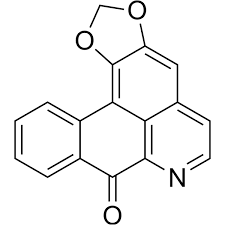

# Efecto de liriodenina sobre trnascriptoma de células de Cáncer colorectal HCT116

## Cáncer en México

El cáncer colorrectal (CCR) es una de las principales causas de muerte por cáncer en México, afectando especialmente a personas mayores de 50 años, aunque también se presentan casos en edades más jóvenes. En 2023, el CCR representó una proporción significativa de las muertes por neoplasias malignas en el país. La mortalidad muestra variaciones importantes entre estados, siendo más alta en lugares como Ciudad de México, Nuevo León, Baja California y Chihuahua, lo que refleja diferencias en acceso a servicios de salud, estilos de vida y programas de detección temprana.

```{r}
#Se cargan librerías necesarias para crear mapa de mortalidad por cáncer a nivel estatal en México
library(dplyr)     #Manipulación de datos   
library(readxl)    #Leer archivos de excel  
library(sf)        #Manejo de datos espaciales vectoriales  
library(ggspatial) #Permite añadir elementos cartográficos  
library(viridis)   #Paletas de colores
library(ggplot2)   #Gráficos 

# Cargar base de datos de muertes por cancer a nivel estatal en México, tomada de: Estadísticas de Defunciones Registradas (EDR) 2023 - INEGI
bd1 <- read_xlsx("muertes_cancer.xlsx")

# Carga archivo vectorial de entidades de México
ent_mex <- st_read("entidades_mex.shp") 

# Realizar un left_join para fusionar los datos, asignar al archivo espacial
bd_join1 <- left_join(ent_mex, bd1, join_by("NOMGEO"=="NOM_ENT"))
bd_join1

#Mapa de muertes por cancer en mexcio

g1 <- ggplot(data = bd_join1) +
  geom_sf(aes(fill=std_MXC))+ #Rellena cada estado con a variable std_MXC
  scale_fill_viridis(discrete = FALSE, option = "D") +
  labs(title = "Mortalidad de cáncer en México por estado",
       fill = "Muertes c/100 habitantes") +
  annotation_scale(location = "bl", width_hint = 0.5) +
  annotation_north_arrow(location = "tr", which_north = "true", 
                         pad_x = unit(0.75, "cm"), pad_y= unit(0.5,"cm"),
                         style = north_arrow_fancy_orienteering)+
  theme_minimal()
g1

```

## Productos naturales y liriodenina

El tratamiento actual para el CCR acarrea una serie de efectos secundairos adversos para los pacientes, lo que resalta la búsqueda de nuevas alternativas de tratamiento, destacando el caso de los productos naturales, como la liriodenina, un alcaloide extraido de diferentes especies de plantas de annonaceae. Investigaciones han demostrado que la liriodenina inhibe la proliferación de células cancerosas humanas, como las de ovario y colon.



## Perfil de expresión diferencial

Por lo tanto en éste proyecto se planteó determinar el efecto que causa el tratamiento de liriodenina sobre el transcriptoma de células de CCR HCT116, por medio de experimentos de microarreglos.

```{r}
library(ggrepel)        # Para etiquetas que no se sobrepongan en plots

##Volcano plot de genes diferencialmente expresados
# Cargar base de datos
bd2 <- read_xlsx("Base_lirio_completa.xlsx")
bd2

# Crear columna de selección diferencial
bd2 <- bd2 %>%
  mutate(Expression = case_when(      #creo una condición para asignar colores
    Fold_change > 2 ~ "Sobreexpresado",
    Fold_change < -2 ~ "Subexpresado",
    TRUE ~ "ND"
  ))

# Se crea volcano plot
g2 <- ggplot(bd2, aes(x = Fold_change, y = -log10(p_value))) +
  geom_point(aes(color = Expression), size = 2, alpha = 0.8) + #Asigno el color de cada punto a la variable "Expression"
  scale_color_manual(values = c("Sobreexpresado" = "red",
                                "Subexpresado" = "blue",
                                "ND" = "gray")) +
  geom_text_repel(data = bd2 %>%
                    slice_min(order_by = p_value, n = 10),
                  aes(label = GENE_ID),
                  size = 2.5,
                  box.padding = 0.2, #distancia min entre etiquetas
                  point.padding = 0.4,) + #Distancia entre texto y el punto
  geom_vline(xintercept = c(-2, 2), linetype = "dashed", color = "black", linewidth = 0.8) + #creo lineas punteadas verticales 
  geom_hline(yintercept = -log10(0.05), linetype = "dashed", color = "black", linewidth = 0.8) + #creo linea punteada horizontal
  theme_minimal(base_size = 12)+
  labs(
    x = "Fold Change",
    y = "-Log10(p-value)",
    color = "Estado",
    title = "Expresión diferencial en células Hct-116 tratadas con Liriodenina",
    subtitle = "tratadas vs no tratadas"
  ) +
  theme(
    plot.title = element_text(hjust = 0.5),
    plot.subtitle = element_text(hjust = 0.5),
    legend.position = "top")+
  coord_cartesian(xlim = c(-50, 50), ylim = c(0, 10)) #Ajusto los límites visibles del gráfico

g2
```

En el volcano plot podemos observar una expresión diferencial considerable inducido por eltratamiento con liriodenina.

```{r}
####Barplot de genes sobre y sub expresados

g3 <- bd2%>%
  filter(Expression != "ND") %>% #Excluyo genes sin diferencia significativa
  ggplot(aes(x = Expression, fill = Expression)) +
  geom_bar(width = 0.5, color = "black") +
  geom_text(stat = "count", aes(label = after_stat(count)), vjust = -0.5, size = 4) + #indico que se calculen conteos directamente con stat
  scale_fill_manual(values = c("Sobreexpresado" = "red",
                               "Subexpresado" = "blue")) +
  ylab("Número de genes diferencialmente expresados") +
  ggtitle("Genes diferencialmente expresados tras tratamiento con Liriodenina") +
  theme_minimal(base_size = 12) +
  theme(legend.position = "none") #quito la layened ay aque ya esta indicada
g3
```

Del total de los genes evaluados, se obtuvieron 3222 genes diferencialmente expresados (DEG´S), siendo 1678 sobreexpresados y 1544 resultaron subexpresados.

## DEG´S asociados a vías de señalización involucradas en la progresión del CCR

Existen múltiples vías de señalización molecular que en condiciones de homeostasis se encargan de mantener las funciones necesarias de cuaqluier tipo de celula, no obstante, en el caso del cáncer, y en específico del CCR, se ha observado que la actividad aberrante vías particulares se encuentran directamente ligadas con la carcinogénesis y progresión tumoral, convirtiendolas en posibles blancos terapéuticos para inhibir el avance de la enfermedad.

```{r}
#### Donut plot de DEGS y genes involucradps en ías de señalización de progresión tumoral en CCR.

# Filtrar base de datos con genes degs unicamente
bdDEG <- bd2 %>% filter(Expression != "ND")

# Cagar bases de datos de genes involuvcrados en vías de señalización
WNT_g <- read_xlsx("Wnt_genes.xlsx")
PI3K_g <- read_xlsx("PI3K_genes.xlsx")
MAPK_g <- read_xlsx("MAPK_genes.xlsx")
NOTCH_g <-read_xlsx("NOTCH_genes.xlsx") 
TGFB_g <- read_xlsx("TGFB_genes.xlsx")

# Crear conjuntos de genes en comun
WNT <- inner_join(bdDEG, WNT_g, by = "GENE_ID")
PI3K <- inner_join(bdDEG, PI3K_g, by = "GENE_ID")
MAPK <- inner_join(bdDEG, MAPK_g, by = "GENE_ID")
NOTCH <- inner_join(bdDEG, NOTCH_g, by = "GENE_ID")
TGFB <- inner_join(bdDEG, TGFB_g, by="GENE_ID")

# Crear un data frame con el número de genes por vía
datos_vias <- data.frame(
  Via_de_señalización = c("WNT", "PI3K", "MAPK", "NOTCH", "TGFB"),
  Genes = c(nrow(WNT), nrow(PI3K), nrow(MAPK), nrow(NOTCH), nrow(TGFB)) #número de filas (genes) de cada vía 
   )
#Calcular el porcentaje de cada categoría
datos_vias <- datos_vias %>%
  mutate(Porcentaje = round(Genes / sum(Genes) * 100, 1), #round redondea a un decimal
    etiqueta = paste0(Via_de_señalización, "\n", Porcentaje, "%") #creo una etqiueta para el plot con un salto de línea
  )
# Crear el donut plot
g4 <- ggplot(datos_vias, aes(x = 2, y = Genes, fill = Via_de_señalización)) + #asigno x= para que sea una sola barra que luego será circular
  geom_bar(stat = "identity", width = 1, color = "white") + # en stat estoy asignando que tome en cuenta el valor exacto 
  coord_polar(theta = "y", start = 0) + #Hago la grafica circular asignando que la variable y determina el tamaño de cada sector
  xlim(0.5, 2.5) + 
  theme_void() +    
  scale_fill_manual(values = c("WNT" = "blue",   
                               "PI3K" = "darkgreen", 
                               "MAPK" = "red",
                               "NOTCH"= "gold",
                               "TGFB"="orange")) +
  geom_text(aes(label = etiqueta),
            position = position_stack(vjust = 0.5), #centro el texto verticalmente en cada sector
            color = "white", size = 5
            , fontface = "bold") +
  ggtitle("Porcentaje de involucrados en vías de señalización") +
  theme(plot.title = element_text(hjust = 0.5, size = 14, face = "bold")) 
 
g4


```

Se puede observar que la vía de señalización con la mayor cantidad de DEG´s, es la de PI3K, la cual es una vía que regula multiples procesos de crecimiento y proliferación celular, a continuación se realiza un heatmap para observar el perfil de expresión diferencial exclusivo de la vía.

```{r}
#### Heatmap de las vías mas representadas
library(ComplexHeatmap) # Heatmaps con clustering y anotaciones
library(circlize)       # Función colorRamp2 para paletas de colores
library(grid)           # para para personalizar texto en Heatmap

#creo nuevo data frame unicamente con indicadores y datos de expresion
PI3Khm<- PI3K %>%
  select(GENE_ID, B_1, B_2, B_3, LI_1, LI_2, LI_3)

# Convierto a matriz, que se necesita para la función de heatmap 
PI3Kmat <- as.matrix(PI3Khm[,-1])  
rownames(PI3Kmat) <- PI3K$GENE_ID #asigno nombres de los genes como nombres de fila a la matriz
PI3Kmat <- t(scale(t(PI3Kmat))) #normalizo a z score

#  Crear un vector para indicar tratamiento

col_anno <- c("Basal","Basal","Basal","Lirio","Lirio","Lirio")


# Definir paleta de colores
color <- colorRamp2(c(-2, 0, 2), c("blue", "white", "red"))

# Crear heatmap
g5 <-Heatmap(
  PI3Kmat,
  name = "Zscore",
  col = color,
  show_row_names = TRUE,
  row_names_gp = gpar(fontsize = 7),
  show_column_names = FALSE,
  cluster_rows = FALSE,
  cluster_columns = FALSE,
  top_annotation = HeatmapAnnotation(
    Condición = col_anno,
    col = list(Condición = c("Basal" = "blue", "Lirio" = "red"))
  ),  
  column_title = "Expresión diferencial en la vía PI3K/AKT",  
  column_title_gp = gpar(fontsize = 14, fontface = "bold")
)

g5

```

## Conclusiones

El tratamiento con liriodenina induce una respuesta transcripcional distinguible sobre genes involucrados en vías de señalizaciónasociados a la progresión tumoral del CCR, siendo la vía de PI3K la que present+o una mayor cantidad de DEG´s, sugiriendo un posible efecto modulatorio del compuesto sobre la vía, dando pauta a la planeación de ensayos funcionales sobre la actividad de la vía y su impacto sobre la progresión tumoral del CCR.
